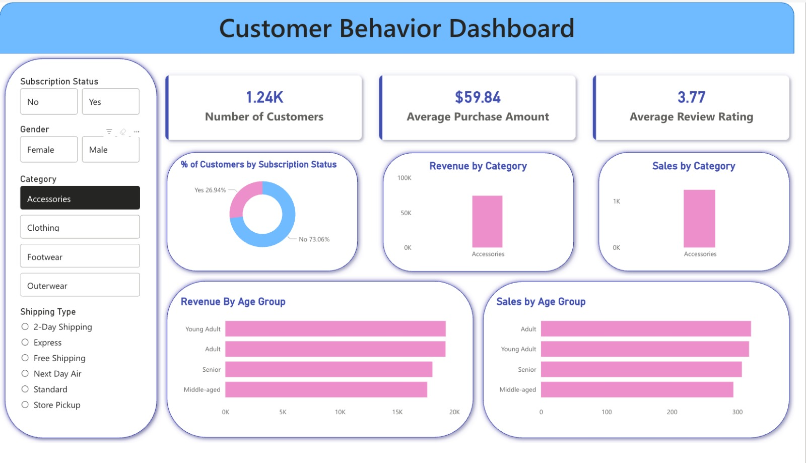

# Customer Shopping Behavior Analysis

A beginner-friendly data analytics project built to practice **Python**, **PostgreSQL/SQL**, and **Power BI**. The project analyzes customer shopping behavior from transactional data to understand customer segments, spending patterns, product preferences, discounts, subscriptions, and revenue trends.

## Project Objective

The goal of this project is to clean and analyze customer purchase data, store the processed data in PostgreSQL, answer business questions using SQL, and build an interactive Power BI dashboard for business insights.

## Dataset Overview

- **Rows:** 3,900 customer purchase records
- **Columns:** 18 features
- **Key fields:**
  - Customer demographics: age, gender, location, subscription status
  - Purchase details: item purchased, category, purchase amount, season, size, color
  - Shopping behavior: discount applied, previous purchases, frequency of purchases, review rating, shipping type
- **Missing values:** 37 missing values in the `review_rating` column

## Tools and Technologies Used

- **Python**: data cleaning, preprocessing, feature engineering
- **Pandas**: data exploration and transformation
- **PostgreSQL**: database storage and SQL analysis
- **SQL**: business question analysis
- **Power BI**: dashboard creation and visualization
- **Jupyter Notebook**: project development and documentation

## Project Structure

```text
CUSTOMER_BEHAVIOUR_ANALYSIS/
├── assets/
│   └── dashboard.jpeg
├── customer_shopping_behavior.csv   # Raw customer shopping dataset
├── customers.pbix                   # Power BI dashboard file
├── notebook.ipynb                   # Python cleaning, PostgreSQL loading, and SQL analysis
├── README.md                        # Project documentation
├── .gitignore                       # Files to exclude from GitHub
└── .env.example                     # Example environment variables file
```

## Data Cleaning and Preparation

The dataset was first explored and cleaned using Python.

Main steps included:

1. Loaded the CSV file using Pandas.
2. Checked dataset structure using `.info()` and summary statistics using `.describe()`.
3. Handled missing values in `review_rating` by imputing them using the median review rating for each product category.
4. Standardized column names into `snake_case` format for better readability.
5. Created an `age_group` column to group customers by age range.
6. Created a `purchase_frequency_days` column from the purchase frequency data.
7. Checked whether `discount_applied` and `promo_code_used` were redundant.
8. Dropped `promo_code_used` after confirming it repeated similar information.
9. Loaded the cleaned dataset into PostgreSQL for SQL-based analysis.

## SQL Business Analysis

After loading the cleaned data into PostgreSQL, SQL queries were used to answer the following business questions:

1. **Revenue by Gender**  
   Compared total revenue generated by male and female customers.

2. **High-Spending Discount Users**  
   Identified customers who used discounts but still spent above the average purchase amount.

3. **Top 5 Products by Rating**  
   Found products with the highest average review ratings.

4. **Shipping Type Comparison**  
   Compared average purchase amounts across different shipping types.

5. **Subscribers vs. Non-Subscribers**  
   Compared average spend and total revenue between subscribed and non-subscribed customers.

6. **Discount-Dependent Products**  
   Identified products with the highest percentage of discounted purchases.

7. **Customer Segmentation**  
   Classified customers into New, Returning, and Loyal segments based on purchase history.

8. **Top 3 Products per Category**  
   Listed the most purchased products within each product category.

9. **Repeat Buyers and Subscriptions**  
   Checked whether customers with more than five previous purchases were more likely to subscribe.

10. **Revenue by Age Group**  
    Calculated total revenue contribution from each customer age group.

## Power BI Dashboard

The final dashboard was created in Power BI to present the insights visually.



Dashboard highlights include:

- Total number of customers
- Average purchase amount
- Average review rating
- Customer distribution by subscription status
- Revenue by category
- Sales by category
- Revenue by age group
- Sales by age group
- Filters for subscription status, gender, category, and shipping type

## Key Business Recommendations

Based on the analysis, the following business recommendations were identified:

- **Boost subscriptions:** Promote exclusive benefits to increase the number of subscribed customers.
- **Improve loyalty programs:** Reward repeat buyers and encourage them to become loyal customers.
- **Review discount strategy:** Balance discount usage with revenue and margin impact.
- **Promote top products:** Highlight top-rated and best-selling products in marketing campaigns.
- **Target high-value customer groups:** Focus marketing efforts on high-revenue age groups and customers using faster shipping options.

## How to Run This Project Locally

### 1. Clone the repository

```bash
git clone https://github.com/your-username/customer-shopping-behavior-analysis.git
cd customer-shopping-behavior-analysis
```

### 2. Install Python dependencies

```bash
pip install pandas sqlalchemy psycopg2-binary python-dotenv
```

### 3. Create a `.env` file

Create a `.env` file in the project folder and add your PostgreSQL credentials:

```env
POSTGRES_USER=your_username
POSTGRES_PASSWORD=your_password
POSTGRES_HOST=localhost
POSTGRES_PORT=5432
POSTGRES_DB=your_database_name
```

Do not upload the `.env` file to GitHub.

### 4. Run the Jupyter Notebook

Open and run:

```text
notebook.ipynb
```

The notebook performs data cleaning, feature engineering, PostgreSQL loading, and SQL analysis.

### 5. Open the Power BI dashboard

Open the Power BI file:

```text
customers.pbix
```

Use the dashboard filters to explore customer behavior across subscription status, gender, category, and shipping type.

## Security Note

Database credentials should never be hardcoded inside the notebook or pushed to GitHub. This project uses environment variables through a `.env` file for safer credential management.

The `.env` file should be listed in `.gitignore`, and only `.env.example` should be shared in the repository.

## Future Improvements

- Add more advanced customer segmentation.
- Build predictive models for customer loyalty or subscription likelihood.
- Add automated data refresh for Power BI.
- Create a Python dashboard using Streamlit or Flask.
- Add more detailed documentation for SQL queries and dashboard design.

## Author

**Nakshatra Pawar**  
Master's Student in Applied Data Science, University of Southern California